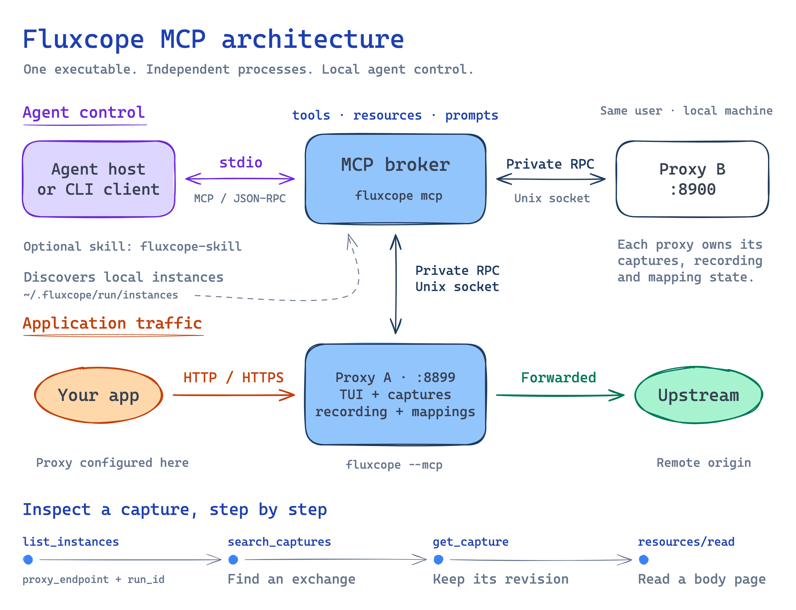

# Fluxcope

A terminal HTTP and HTTPS debugging proxy with request recording, searchable request trees, body inspection, and local/remote response mapping.

Fluxcope includes an optional multi-instance MCP control plane for coding agents; see [MCP setup and capabilities](#mcp-control-plane).

## Installation

Once a version is available in [Releases](https://github.com/LorNtz/fluxcope/releases), install it through Homebrew or crates.io:

```sh
brew install LorNtz/tap/fluxcope
# Or build the published crate (Rust 1.98 or newer):
cargo install fluxcope --locked
```

Release archives target macOS 15+ (Apple Silicon and Intel) and Linux with glibc 2.28+ (ARM64 and x86-64). Homebrew installation is tested separately on systems supported by Homebrew. macOS 13 and 14 are outside the supported range.

macOS archives are unsigned and are not notarized. Verify the downloaded archive against the release checksums and its GitHub build attestation before running it. See [release verification](docs/releasing.md). If Gatekeeper blocks a verified executable, remove quarantine only from that file with `xattr -d com.apple.quarantine /absolute/path/to/fluxcope`; do not disable Gatekeeper globally.

## Run

```sh
fluxcope --help
fluxcope --version
fluxcope
```

Point your client's HTTP/HTTPS proxy at this machine and the port shown in the status bar (default 8989). The proxy listens on **all IPv4 interfaces**, with no client authentication. Run it only on a trusted network or restrict access with your host firewall. Recording can contain credentials, cookies and personal data.

Settings live in `~/.fluxcope/config.yml`. Fluxcope does not read or migrate state from earlier development builds under another application name. Proxy settings include optional named presets, map-remote, map-local and recording URL filters; edit them through the settings UI.

## MCP control plane

Fluxcope exposes its live proxy state through the [Model Context Protocol (MCP)](https://modelcontextprotocol.io/docs/learn/architecture), so coding agents can investigate captured traffic and change recording or mappings. MCP is available in Fluxcope 0.2.0, is disabled by default, and currently requires Unix.

### Architecture



[Editable Excalidraw source](docs/assets/mcp-architecture.excalidraw)

One executable provides three process modes:

- **Proxy and TUI — `fluxcope --mcp`:** owns captured traffic, recording state, and mapping settings. Each running proxy exposes a private Unix control socket and publishes a descriptor under `~/.fluxcope/run/instances`.
- **MCP broker — `fluxcope mcp`:** the agent host launches this process over stdio. It discovers proxies owned by the same OS user and routes calls to the selected instance. It does not start or own the proxy processes.
- **Managed CLI client — `fluxcope mcp tools|call|read`:** launches a broker child from the same executable, performs one command, and shuts the child down. This gives agents that use a shell access to the same tools and resources.

A broker can reach several proxies, each with its own captures and settings. Retain both `proxy_endpoint` and `run_id` from `list_instances`; restarting a proxy creates a new run even if its port is unchanged. The separately installed [agent skill](#agent-skill) supplies workflow instructions to the agent.

### Connect through stdio

Start a proxy in a terminal and keep it running:

```sh
fluxcope --mcp
# Or start a separate loopback proxy with ephemeral settings:
fluxcope --host 127.0.0.1 --port 8899 --mcp
```

Register a local MCP server in your agent host using:

| Setting | Value |
| --- | --- |
| Transport | `stdio` |
| Command | `/absolute/path/to/fluxcope` |
| Arguments | `["mcp"]` |

The host launches the broker and exchanges MCP messages over its stdin/stdout. The proxy port carries application HTTP/HTTPS traffic; it is not an HTTP MCP endpoint. Run the proxy and broker as the same OS user with the same `HOME`, then call `list_instances` to verify discovery. The [setup guide](skills/fluxcope-skill/references/setup.md) covers client-specific registration and preview builds.

### Interface

The broker exposes three MCP interfaces:

| Interface | Discovery and calls | What it provides |
| --- | --- | --- |
| Tools | `tools/list`, `tools/call` | Operations with JSON input schemas for instance discovery, capture inspection, recording, and mappings. |
| Resources | `resources/templates/list`, `resources/read` | `fluxcope://` links tied to a capture revision, for raw or decoded body pages and extracted JSON/form values. Follow links returned by capture and body tools; `resources/list` does not enumerate captures. |
| Prompts | `prompts/list`, `prompts/get` | `debug_http_flow` for capture investigation and `configure_mapping` for mapping changes. Both provide workflows without prompt arguments. |

When native MCP tools are unavailable, inspect schemas and invoke operations through the managed CLI:

```sh
fluxcope mcp tools
fluxcope mcp tools search_captures
fluxcope mcp call list_instances --arguments '{}'
fluxcope mcp call get_mapping_settings --arguments @arguments.json
fluxcope mcp read '<returned fluxcope:// resource URI>'
```

Create `arguments.json` from the selected tool's schema and the instance returned by discovery. Arguments can also be inline JSON or `-` for stdin. The CLI manages initialization, deadlines, and JSON output; it does not automatically retry mutations. Its default deadline is 60 seconds. For a five-minute capture wait, use `fluxcope mcp --timeout-secs 360 call wait_for_capture --arguments @wait.json`.

### Tools and capabilities

| Capability | Tools | Behavior |
| --- | --- | --- |
| Discovery and health | `list_instances`, `get_broker_status`, `get_status` | Find live instances and inspect configuration mode, capture capacity, warnings, metrics, and bounded audit data. |
| Recording | `set_recording_enabled` | Enable or disable capture storage. Traffic still forwards and mappings still apply when recording is off. |
| Capture inspection | `search_captures`, `wait_for_capture`, `get_capture` | Search retained metadata with pagination, wait for request/response milestones, and retrieve an exact capture revision with body links. |
| Body search and extraction | `search_capture_body`, `extract_capture_body` | Find text with bounded context or extract an exact JSON pointer or URL-form field. |
| JSON structure | `find_json_pointers`, `probe_json_pointer_pattern` | Locate fields and inspect structural matches without returning their values. |
| Mapping planning | `get_mapping_settings`, `validate_mapping_settings`, `explain_mapping`, `preview_mapping_mutation` | Read ordered rules, validate proposed settings, and explain or preview remote-then-local mapping decisions without sending traffic or reading mapped files. |
| Presets | `create_preset`, `rename_preset`, `delete_preset`, `set_active_preset` | Manage named presets and explicitly choose the active one. Creating a preset does not activate it. |
| Mapping gates | `set_mapping_gate` | Explicitly enable or disable mapping gates. |
| Mapping rules | `create_mapping_rule`, `update_mapping_rule`, `delete_mapping_rule`, `move_mapping_rule`, `set_mapping_rule_enabled` | Manage map-remote and map-local rules, their order, and their enabled state. |

A capture investigation usually follows `list_instances` → `search_captures` or `wait_for_capture` → `get_capture` → targeted body inspection. Body reads use the capture's revision and return bounded pages; follow returned pagination metadata and report retention, truncation, or decoding limits.

For mapping changes, read the current `settings_revision`, preview the intended operation, then call the matching mutation tool with the same `expected_settings_revision`. A preview does not reserve that revision: concurrent edits or unfinished TUI drafts can reject the write. Default-owned settings persist to disk; temporary instances and instances launched with a read-only config file keep changes in memory. Check the returned persistence mode and verify the effect with new traffic when needed.

Any process running as the same OS user can access MCP-enabled instances, including captured credentials and mapping controls. Keep access local and inspect only the traffic needed for the task.

## Agent skill

[fluxcope-skill](skills/fluxcope-skill/SKILL.md) teaches coding agents how to debug HTTP and HTTPS traffic through Fluxcope's MCP interface. It provides workflows to:

- Find captured requests, inspect headers and bodies, and extract JSON or form values.
- Control recording and manage mapping presets and rules with revision checks.
- Set up the MCP connection, select the right proxy instance, and troubleshoot preview builds.

### Install the skill

With Node.js and npm available, run this in your terminal to install the latest skill from `master`:

```sh
npx skills@latest add LorNtz/fluxcope --skill fluxcope-skill
```

Follow the installer prompts to choose your agents and whether to install for the current project or globally. Run the same command again when you want to update to the latest skill.

### Connect and use

Skill installation adds instructions to your agent; install Fluxcope and register its MCP server separately. Follow the [MCP setup guide](skills/fluxcope-skill/references/setup.md) for supported Fluxcope versions, client registration, and preview-build limitations, or ask your agent: “Use fluxcope-skill to set up the Fluxcope MCP connection.”

Once your proxy is running with MCP enabled and capturing traffic, try: “Use fluxcope-skill to find failed API requests and inspect their response bodies.”

See the [skill changelog](skills/CHANGELOG.md) for version history and the [skill release procedure](docs/skill-releases.md) for publishing updates.

## HTTPS and the local CA

Fluxcope creates a local certificate authority in `~/.fluxcope/certificate/`. For HTTPS inspection, explicitly trust **only the public certificate** `fluxcope-ca.pem` in the client you are testing. Press `c` to show the temporary certificate download URL and QR code. The download server is reachable from the local network while the app is running; it serves the public certificate only.

Never share `ca_key.der` or your state directory. Never disable client certificate verification as an alternative to trusting the test CA. When debugging is finished, disable the client's proxy and remove the Fluxcope CA from every client or trust store where you installed it. Deleting the local CA files does not remove trust from those clients. Stop Fluxcope before removing its local state.

## Keyboard controls

| Key | Action |
| --- | --- |
| `Tab` / `Shift+Tab` | Move panel focus |
| `Ctrl+h/j/k/l` | Directional focus |
| Arrow keys / `h/j/k/l` | Navigate the focused view |
| `r` | Toggle request recording |
| `/` | Search the request tree or entered body editor |
| `Enter` / `Esc` | Enter or leave a read-only body editor |
| `d` / `D` | Delete the selected request/subtree or all captures |
| `c` | Show the CA certificate download popup |
| `m` | Open settings |
| `@` | Toggle the log view |
| `q` | Quit the application |

Bodies support Vim-style navigation, selection/copy and visible-text jumps. Mouse navigation and scrolling are supported. The log view overlays the workspace while preserving the status bar.

## Development and security

See [CONTRIBUTING.md](CONTRIBUTING.md), [SECURITY.md](SECURITY.md), and the [release runbook](docs/releasing.md). Licensed under either [MIT](LICENSE-MIT) or [Apache-2.0](LICENSE-APACHE), at your option.
