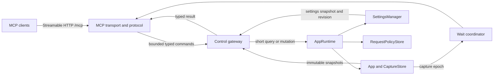

# Embedded MCP Server Design

Date: 2026-08-24
Status: Approved design, pending written-spec review

## 1. Purpose

Wirelens will embed a Model Context Protocol server so local LLM agents can inspect captured HTTP exchanges and control proxy mappings while debugging other applications.

The first release serves two workflows:

1. Find retained captures, inspect compact request/response metadata, and retrieve only relevant body regions or structured fields.
2. Inspect, validate, create, edit, activate, and toggle proxy mapping presets and rules.

The MCP server runs inside the normal Wirelens process. The initial release requires the TUI process, but its protocol, command, query, and mutation layers must not depend on terminal UI types so a future headless runtime can reuse them.

## 2. Scope

### 2.1 Included

- Opt-in localhost Streamable HTTP MCP service.
- Current stable MCP protocol plus earlier-version compatibility supplied by the official Rust MCP SDK.
- Compact runtime/proxy/capture status.
- Explicit live recording enable/disable control.
- Typed capture search over retained metadata and headers.
- In-flight capture visibility through immutable snapshots.
- Request/response detail retrieval without body payloads.
- Bounded waiting for current or future matching captures.
- Raw and content-decoded body resources with bounded ranges.
- Bounded body text search that returns snippets and resource windows.
- JSON Pointer and form-field extraction.
- JSON field-name-to-pointer discovery.
- Wildcard JSON pointer-pattern structural probing.
- Mapping preset lifecycle, rule lifecycle, parent gates, dry-run validation, and URL decision explanation.
- Immediate validated persistence and live policy application for MCP mutations.
- Optimistic settings revisions and dirty-TUI-draft conflict rejection.
- Mutation audit records and aggregated read metrics.
- MCP prompts for HTTP-flow debugging and mapping configuration.

### 2.2 Excluded

- Remote or LAN MCP access.
- stdio transport in the TUI process.
- OAuth or bearer-token authentication.
- Headless process mode.
- Capture deletion or clearing through MCP.
- Request replay.
- Target-application automation; agents use other tools to trigger the app under test.
- Searching all retained body content from `search_captures`.
- jq, JSONPath, recursive JSON wildcards, XML selectors, or arbitrary query languages.
- Full historical body versions for live captures.
- Enumerating every retained capture body through `resources/list`.

## 3. Decisions

- The server binds only to `127.0.0.1`.
- The service is disabled by default and uses a fixed configurable port when enabled.
- The default MCP port is `8990`; port `0` and the configured proxy port are invalid.
- Enabled MCP is a required service. Bind failure or unexpected service exit fails Wirelens rather than silently degrading.
- No credential is required in v1. Wirelens must disclose that any local process able to reach the endpoint can read raw retained traffic and alter mappings.
- Mapping writes apply and persist immediately after complete validation.
- Presets are identified by case-sensitive name. Rules are identified by preset name, table, and index together with an expected settings revision.
- MCP writes are rejected while the TUI settings popup has unsaved changes.
- Capture search results are lightweight and refer to heavier data by capture ID, revision, and resource URI.
- Live captures are visible as immutable per-call snapshots.
- `get_capture` never returns body payloads. Body pages use resources; targeted extraction may inline only a selected value within the 4 KiB threshold.
- Resource paging remains available, but agents should first use text location or structured extraction to avoid flooding context.
- Capture mutations are limited to explicit recording enable/disable.
- Deterministic tools are complemented by user-invoked MCP prompts; Wirelens does not implement agentic multi-step workflow tools.

## 4. Architecture



### 4.1 Module boundaries

The implementation should introduce a feature-oriented `mcp` module with these responsibilities:

- `mcp::transport`: loopback HTTP binding, `/mcp` routing, Host/Origin checks, request limits, and SDK transport integration.
- `mcp::server`: MCP capabilities, server identity, tool/resource/prompt routing, annotations, and protocol-facing schemas.
- `mcp::control`: bounded command client, command/result types, cancellation, deadlines, and runtime reply handling.
- `mcp::capture`: capture query schemas, compact result conversion, wait orchestration, and detail snapshot conversion.
- `mcp::body`: body resource handling, bounded decode jobs, text location, form extraction, and body result metadata.
- `mcp::json`: field-pointer discovery, pointer-pattern probing, JSON Pointer extraction, and structural limits.
- `mcp::mapping`: MCP mapping schemas and conversion to settings-domain operations.
- `mcp::prompts`: prompt definitions that reference only real tools and resources.
- `mcp::audit`: mutation audit events and aggregated read metrics.

Exact file splitting may be adjusted during implementation to keep cohesive files at maintainable size. Transport-facing modules must not import `App`, Ratatui, Crossterm, or UI settings-popup types.

Mapping operations belong in a UI-independent settings-domain module shared by the TUI draft and MCP commands. The MCP layer must not call private settings-popup editing methods.

### 4.2 Runtime ownership

`AppRuntime` remains the serialization point for authoritative capture-store access and committed settings changes. MCP handlers do not receive shared mutable access to `App`, `CaptureStore`, or `SettingsManager`.

A bounded, non-dropping command channel carries typed requests into the runtime. Each command contains a cancellation-aware one-shot reply. Runtime processing must:

- reject commands after shutdown begins;
- enforce a bounded number of pending and incremental commands;
- avoid awaiting while application state is borrowed;
- clone only compact values or `Arc`-backed immutable body/header data;
- never decode bodies, parse JSON, serialize large responses, or wait for future traffic in the runtime loop.

Large or CPU-heavy body work occurs in bounded MCP-owned blocking jobs after the runtime has released authoritative state.

### 4.3 Startup and supervision

Startup order:

1. Load and validate settings.
2. Validate `mcp.port != 0` and `mcp.port != server.port` when MCP is enabled.
3. Compile the initial request policy.
4. Bind all required listeners, including MCP when enabled.
5. Start the proxy, MCP, and other supervised services.
6. Enter the TUI and event loop.

MCP bind failure aborts startup before the application becomes operational. The service is tracked by `ServiceSupervisor`. Unexpected MCP task exit is fatal and follows the existing controlled shutdown and terminal-restoration path.

### 4.4 Configuration

Add an optional default-valued settings section:

```yaml
mcp:
  enable: true
  port: 8990
```

The default is disabled with port `8990`. Serialization omits a semantically default MCP section while preserving explicitly present default entries through the existing generic YAML preservation behavior.

The bind host is not configurable in v1.

## 5. Protocol and transport

- Use the official Rust MCP SDK (`rmcp`) server support.
- Expose Streamable HTTP at `http://127.0.0.1:<port>/mcp`.
- Support the stable MCP protocol implemented by the selected SDK release and its documented backwards-compatible lifecycle/version handling for mainstream CLI, desktop, and IDE hosts.
- Do not attach MCP framing to process stdin/stdout.
- Advertise tools, resources, resource templates, and prompts.
- Return schema-validated structured content for tool results.
- Annotate read-only, idempotent, and destructive tools accurately. All Wirelens operations are closed-world with respect to external network effects; proxy traffic itself remains outside MCP tool execution.
- Enforce a bounded HTTP request body, bounded concurrent requests, per-request deadline, and cancellation when an HTTP response stream closes.

## 6. State and consistency model

### 6.1 Identities and revisions

- `capture_id`: decimal representation of the monotonic `CaptureSequence` assigned at request admission.
- `capture_revision`: per-record revision incremented when response metadata, published body bytes, terminal state, or capture timing changes.
- `store_revision`: increments when a capture is added, evicted, removed, or the store is cleared.
- `capture_epoch`: runtime monotonic change signal incremented for store changes and externally visible per-capture revision changes. It wakes waiters.
- `settings_revision`: process-local optimistic concurrency token initialized after settings load and incremented after every successful TUI or MCP commit.

Evicted capture IDs are never reused. Settings revisions are not persisted and have meaning only for one Wirelens process lifetime.

### 6.2 Capture snapshots

Add one capture-record snapshot operation that acquires the record lock once and returns an internally consistent value containing:

- request and optional response metadata;
- request and response body statuses;
- `Arc<Bytes>` body previews when requested by the internal caller;
- timing values;
- metadata truncation;
- capture revision.

A resource or targeted body tool requires the capture revision obtained from capture detail. If the live record has changed, the server returns `capture_revision_conflict` with the current revision. Wirelens does not retain old live-body revisions.

### 6.3 Capture timing

Each admitted capture records:

- UTC request start timestamp;
- monotonic elapsed duration until response metadata is installed;
- monotonic elapsed duration until both request and response body streams become terminal.

In-flight snapshots omit durations not yet known. UTC is used only for correlation; elapsed values never derive from wall-clock differences.

### 6.4 Settings commit transaction

Every settings write requires `expected_settings_revision` and follows this order:

1. Compare the expected and current revisions.
2. Reject the write if the TUI has a dirty settings draft.
3. Clone the current `AppSettings`.
4. Apply exactly one typed domain mutation.
5. Validate and compile the complete candidate request policy.
6. Serialize using the existing semantic-default and key-order preservation behavior.
7. Write a same-directory temporary file, flush it, and atomically rename it over the config.
8. Swap the already-compiled live request policy.
9. Update runtime/App settings, increment the revision, and refresh a clean open TUI settings draft.
10. Return the new revision and affected domain object.

Validation, compilation, or I/O failure leaves the previous persisted settings, live policy, App settings, TUI draft, and settings revision unchanged.

## 7. MCP tool surface

All collection limits are bounded. Tool schemas reject unknown enum values, invalid IDs, invalid ranges, and unbounded requests.

### 7.1 Status and recording

#### `get_status`

Returns compact:

- local proxy URL and actual proxy listen address;
- MCP URL and protocol/server version;
- recording state;
- active preset and global/section mapping gates;
- capture count, store revision, capture epoch, and retention limits;
- capture admission, truncation, memory-pressure, and decode metrics;
- MCP saturation, cancellation, body-job, bytes-returned, and audit aggregation metrics;
- server-enforced search, resource, JSON, and timeout limits;
- the unauthenticated-local-access warning.

#### `set_recording_enabled`

Input: explicit `enabled: bool`.

Returns previous and current state. It changes only the live recording state and is idempotent. It does not edit `recording.start_record_on_launch`.

### 7.2 Capture discovery

#### `search_captures`

AND-combined optional filters:

- method;
- original/effective URL substring;
- original/effective URL glob;
- exact status or inclusive status range;
- retained header name and optional value substring;
- mapping path: `unmapped`, `remote_only`, `local_only`, or `remote_then_local`;
- lifecycle: `live`, `complete`, `failed`, or `cancelled`;
- UTC start-time bounds;
- capture sequence bounds;
- Unicode text query across method, original/effective URLs, status text, and retained headers.

Mapping paths are derived without ambiguity: original and effective URLs differing means remote mapping occurred; a local path means local mapping occurred; both facts produce `remote_then_local`. Lifecycle precedence is `failed` when either side failed, then `cancelled` when either side was cancelled, `complete` when both sides completed, and `live` otherwise.

Results are newest-first. Pagination uses a sequence cursor rather than an index, so retention and new arrivals do not shift an existing page boundary.

Each compact row contains only:

- capture ID and revision;
- method;
- original and effective URL;
- mapping path;
- status and lifecycle;
- UTC start, time-to-response, and total duration when known;
- per-side observed bytes, retained bytes, stream state, and truncation/limit flags.

No header values or body payloads are returned in search results.

Default page size is 20; maximum is 100.

#### `get_capture`

Input: capture ID and optional expected capture revision.

Returns one internally consistent detail snapshot:

- request method, original/effective URL, mapping metadata, and retained headers;
- optional response status and retained headers;
- timing and lifecycle;
- metadata truncation;
- request/response body descriptors;
- current capture revision;
- concrete first-page body resource links for every available side/representation.

It does not return body payloads.

#### `wait_for_capture`

Accepts the same filters as capture search plus:

- milestone: `request_seen`, `response_started`, or `exchange_terminal`;
- timeout, default 30 seconds and maximum 5 minutes.

Status-dependent filters cannot match before response metadata exists. The tool subscribes to `capture_epoch` before its initial query, preventing a change between subscription and first scan from being missed. `exchange_terminal` accepts complete, failed, and cancelled terminal outcomes. The tool returns the first newest matching compact row or `{ "matched": false }` on timeout. Timeout is not a tool error.

### 7.3 Targeted body tools

Every targeted body tool requires capture ID, expected capture revision, and side. It operates on content-decoded bytes unless explicitly documented otherwise. Decode and parse work occurs off the runtime thread under hard input/output/concurrency budgets. JSON field discovery and pointer-pattern probing use streaming traversal so their retained working state is proportional to nesting depth and bounded results rather than the complete JSON object graph.

#### `search_capture_body`

Inputs:

- Unicode text query;
- maximum matches, default 10 and maximum 50;
- context bytes per side, default 160 and maximum 1024.

Returns bounded before/match/after snippets, decoded byte ranges, exact larger-window resource links, total/omitted match counts, decoded bytes inspected, capture/body truncation, and revision. Binary or undecodable content returns a typed non-textual/decoding result with the raw resource fallback.

#### `extract_capture_body`

Selectors:

- exact RFC 6901 JSON Pointer for JSON;
- key for `application/x-www-form-urlencoded`, preserving repeated values.

A scalar or compactly serialized selected JSON value up to 4 KiB is returned inline. Larger JSON selections return selector-specific paged resources containing the same compact JSON representation. Form extraction returns repeated decoded values as a JSON string array, inline or resource-backed under the same threshold. Every result includes type, selected representation size, source-body truncation, and capture revision. A missing JSON pointer returns the longest valid prefix and a bounded set of next keys/types without returning the parent value.

#### `find_json_pointers`

Finds object fields by key name without returning values.

Inputs:

- field name;
- match mode: `exact` or `unicode_casefold_exact`;
- maximum results, up to 20 examples.

Each match contains the exact escaped RFC 6901 pointer and value shape only:

- JSON type;
- object child count;
- array length; or
- scalar encoded byte size.

The result reports total and omitted matches, decoded bytes inspected, truncation, and revision.

#### `probe_json_pointer_pattern`

Tests structure without returning values.

Pattern rules:

- split and decode as JSON Pointer segments;
- `~0` means `~`;
- `~1` means `/`;
- an unescaped segment exactly equal to `*` matches one object key or array index;
- `~2` means a literal `*` key;
- no recursive wildcard exists;
- the empty pattern addresses the document root, while `/` addresses an empty object key as defined by RFC 6901;
- a pattern without a wildcard also performs a cheap exact-pointer probe.

Returns total match count, terminal JSON type counts, up to 20 exact pointer examples, up to 20 child keys for each bounded terminal-object summary, bounded length range for terminal arrays, truncation, and revision. When no match exists, it returns the longest matched prefix and up to 20 available next segments/types.

### 7.4 Mapping inspection and validation

#### `get_mapping_settings`

Returns the complete proxy mapping configuration and current settings revision, including inactive presets, disabled parent sections, rule order, and per-rule enable flags. It does not return unrelated certificate or UI settings.

#### `validate_mapping_settings`

Accepts a complete proposed proxy mapping configuration. It applies the same validation and compilation path used by commits and returns typed diagnostics without mutation.

#### `explain_mapping`

Accepts a request URL and either:

- the current live configuration; or
- a complete proposed proxy mapping configuration.

Returns original/effective URL, local path when selected, active preset, matched table/rule index, relevant gate states, and typed diagnostics. It never sends traffic or reads local mapped file contents.

### 7.5 Mapping mutations

Mutation tools:

- `create_preset`
- `rename_preset`
- `delete_preset`
- `set_active_preset`
- `set_mapping_gate`
- `create_mapping_rule`
- `update_mapping_rule`
- `delete_mapping_rule`
- `move_mapping_rule`
- `set_mapping_rule_enabled`

Every tool requires `expected_settings_revision` and returns the new revision. Setters use explicit desired values rather than toggles. `set_mapping_gate` targets global mapping or one named preset's map-remote/map-local section. Rule operations require preset name, table, and index; create/move operations use an explicit destination index validated against the candidate collection.

Preset and rule conventions:

- preset names are trimmed, non-empty, and case-sensitive unique;
- all rule indices are zero-based;
- `create_preset` accepts an optional complete preset definition, defaults to empty enabled mapping sections, and does not activate the preset implicitly;
- renaming the active preset updates `active_preset`;
- deleting the active preset clears `active_preset`;
- `set_active_preset` accepts a preset name or `null` to clear it;
- omitting the insertion index appends a rule;
- a move destination is the final index after the move;
- `update_mapping_rule` updates source and/or target, while enable state uses `set_mapping_rule_enabled`.

Delete tools are annotated destructive. Explicit setters and update-to-a-specified-value operations are annotated idempotent where repeated application has the same result.

## 8. MCP resources

The server advertises templates only; it does not enumerate one resource per capture.

`resources/list` returns an empty direct-resource list. `resources/templates/list` returns the three templates below. The server does not advertise resource subscriptions or list-change notifications in v1.

### 8.1 Content pages

```text
wirelens://captures/{capture_id}/revisions/{capture_revision}/bodies/{side}/content/{representation}{?offset,length}
```

- `side`: `request` or `response`.
- `representation`: `raw` or `decoded`.
- Raw content is returned as MCP blob content.
- Decoded valid UTF-8 is returned as MCP text content with retained media type; decoded binary is blob content.
- Raw byte range is applied before base64 transport encoding.
- Decoded byte range is applied after content decoding.

### 8.2 Structured selection pages

```text
wirelens://captures/{capture_id}/revisions/{capture_revision}/bodies/{side}/extract/json-pointer{?pointer,offset,length}
wirelens://captures/{capture_id}/revisions/{capture_revision}/bodies/{side}/extract/form-field{?key,offset,length}
```

These page only the selected value, not the containing body. JSON selection resources contain deterministic compact JSON. Form-field resources contain a JSON string array so repeated values remain distinct.

### 8.3 Paging and cache metadata

Defaults and maxima:

- default page: 8 KiB;
- maximum page: 64 KiB.

Resource responses use private cache scope and include `_meta.wirelens` result metadata containing:

- requested and actual range;
- total selected representation bytes;
- next-page URI when present;
- capture revision;
- body stream state;
- observed and retained source bytes;
- truncation/limit state.

Text ranges must begin and end on UTF-8 boundaries. Invalid manual boundaries return a structured error with nearest valid offsets. Tool-generated URIs are always aligned.

Live capture resources use no cache lifetime. Terminal resources may use a private cache lifetime, but a capture evicted from Wirelens returns `capture_not_retained`. Wirelens does not promise historical availability based on client cache metadata.

## 9. Prompts

### 9.1 `debug_http_flow`

Arguments may include URL hint, method, expected status, and wait milestone. The prompt guides the host to:

1. inspect status and recording state;
2. explicitly enable recording when the user requested it;
3. trigger the target behavior using tools outside Wirelens;
4. wait or search with narrow filters;
5. inspect compact detail;
6. locate text or JSON structure before reading body content;
7. read only selected resource windows;
8. state retention, truncation, live-state, and decoding limitations in conclusions.

### 9.2 `configure_mapping`

Arguments may include preset, table, source URL, target URL/path, and desired result. The prompt guides the host to:

1. read settings and revision;
2. validate a complete candidate;
3. explain the candidate decision;
4. apply only the user-requested typed mutation;
5. refresh revision after each write;
6. explain the live decision;
7. verify through new traffic and captures when applicable.

Prompts must never name nonexistent tools or imply that Wirelens can drive the target application.

## 10. Limits and scheduling

Initial fixed server limits:

| Limit | Value |
|---|---:|
| HTTP request body | 1 MiB |
| Concurrent HTTP requests | 32 |
| Runtime command channel | 64 requests |
| Concurrent incremental capture searches | 4 |
| Ordinary tool/resource deadline | 30 s |
| Capture search default / maximum | 20 / 100 rows |
| Body resource default / maximum | 8 KiB / 64 KiB |
| Body text matches default / maximum | 10 / 50 |
| Match context default / maximum per side | 160 B / 1 KiB |
| Inline selected structured value | 4 KiB |
| JSON pointer/shape examples | 20 |
| Wait default / maximum | 30 s / 5 min |
| Body decoded/structured input | 16 MiB |
| Active body jobs | 2 |
| Queued body input | 8 jobs and 32 MiB |

These are fixed v1 server constants and are reported by `get_status`; they are not externally configurable. The body decode and queued-input ceilings align with the existing Wirelens decode policy defaults so MCP cannot introduce a larger per-job representation.

Capture store searches execute incrementally under the runtime event budget. Searches scan newest to oldest, stop when a page is full, yield between bounded chunks, and check cancellation/deadline. Concurrent scans are capped and scheduled fairly. No permanent folded-header index is introduced in v1; this avoids duplicating a potentially memory-sized set of retained headers.

`wait_for_capture` waits outside the runtime and rechecks only sequences/revisions that may have changed after an epoch notification. It never parks the runtime loop.

## 11. Security

The Streamable HTTP endpoint must follow MCP local-server protections:

- bind only to loopback;
- accept `Host` only as `127.0.0.1:<configured-port>` or `localhost:<configured-port>`;
- reject a present Origin unless its host is `127.0.0.1` or `localhost`; a local Origin may use a different port for browser-based local tooling;
- allow absent Origin for native clients;
- do not enable permissive CORS;
- cap request body size and concurrency;
- enforce deadlines and cancellation;
- do not place credentials or sensitive content in URLs except unavoidable selector/query material; resource URIs must not include body values;
- do not log captured traffic contents.

Because authentication is intentionally absent, declared MCP client name/version is not a trusted identity. Wirelens must show this warning in startup logs and `get_status`:

> MCP access is unauthenticated. Any local process that can reach this endpoint can read raw retained captures and change proxy mappings.

Raw retained Authorization, Cookie, Set-Cookie, request-body, and response-body data is returned when explicitly requested. There is no default redaction in v1.

Primary protocol references:

- [MCP server concepts](https://modelcontextprotocol.io/docs/2026-07-28/learn/server-concepts)
- [MCP transports](https://modelcontextprotocol.io/specification/2026-07-28/basic/transports)
- [MCP Streamable HTTP security and transport rules](https://modelcontextprotocol.io/specification/2026-07-28/basic/transports/streamable-http)
- [MCP resources](https://modelcontextprotocol.io/specification/2026-07-28/server/resources)
- [Official Rust MCP SDK](https://github.com/modelcontextprotocol/rust-sdk)

## 12. Errors

Transport, framing, unsupported protocol version, and unknown method failures use HTTP/JSON-RPC errors as required by MCP.

Expected domain failures return structured tool errors with:

- stable `code`;
- concise `message`;
- `retryable` boolean;
- typed `details`.

Resource-read domain failures use JSON-RPC errors whose `data` contains the same `code`, `retryable`, and typed `details` shape. They are not encoded as successful resource contents.

Stable initial codes:

- `invalid_argument`
- `capture_not_retained`
- `capture_revision_conflict`
- `settings_revision_conflict`
- `tui_draft_conflict`
- `mapping_validation_failed`
- `unsupported_body_encoding`
- `body_not_textual`
- `structured_body_too_large`
- `invalid_json`
- `resource_limit`
- `service_unavailable`
- `deadline_exceeded`
- `internal_error`

No-match search/probe and wait timeout are successful results. Mapping diagnostics preserve severity, code, preset index/name, table, rule index, field, and message. JSON misses preserve longest valid prefix and bounded next-step metadata.

Internal errors are logged with context, but client responses do not expose filesystem paths, backtraces, or captured contents unless the relevant domain result explicitly requires them.

## 13. Audit and metrics

### 13.1 Writes

Audit every MCP mutation with:

- declared client name/version;
- tool name;
- target identity without captured values;
- prior and resulting settings revision when applicable;
- outcome and stable error code;
- duration.

Do not log mapping body/file contents or captured request/response contents.

### 13.2 Reads

Aggregate reads by declared client and tool every 60 seconds. Emit counts, failures, cancellation, latency buckets, and bytes returned. Do not log every search/resource page and do not log query or body content.

### 13.3 Status metrics

Expose bounded counters for HTTP saturation, command saturation, body-job rejection, cancellation, bytes returned, resource reads, and mutation outcomes through `get_status`.

## 14. Verification

### 14.1 Unit tests

- MCP settings defaults, serialization omission, explicit-default preservation, invalid/same port validation.
- Capture query filters, Unicode text, header matching, newest-first sequence pagination, compact result fields, cancellation, and deadline.
- Capture timing and revision transitions for live and terminal exchanges.
- Single-lock snapshot consistency and stale/evicted capture behavior.
- Raw/decoded resource pages, valid UTF-8 boundaries, binary blobs, malformed/compressed/truncated bodies, next-page metadata, and live revision conflict.
- Text-match snippets, ranges, omitted counts, and tool-generated resource links.
- JSON Pointer escaping, exact extraction, inline/resource threshold, repeated form fields, invalid JSON, and structured limits.
- Field-name exact and Unicode case-folded discovery without values.
- Pointer-pattern `*`, literal `~2`, exact no-wildcard probes, arrays, objects, mixed terminal types, miss prefixes, next-segment hints, and bounded examples.
- Every preset/rule mutation and parent gate using the shared domain operations.
- Mapping validation/explanation agreement with runtime compilation.
- Stale settings revision, dirty TUI draft, clean popup refresh, and I/O rollback.
- Prompt text references only actual tools/resources and does not imply target-app control.
- Audit events omit traffic contents.

### 14.2 Runtime and transport tests

- MCP disabled by default.
- Fixed loopback bind, `/mcp` routing, occupied port, invalid Host, invalid Origin, request-size cap, protocol-version compatibility, cancellation, and deadline.
- Enabled-service startup and fatal unexpected exit through `ServiceSupervisor`.
- Bounded command scheduling and event-loop progress during worst-case absent searches.
- Two concurrent readers and conflicting concurrent writers.
- Wait subscription-before-query ordering, each milestone, status filters, live changes, eviction, timeout, cancellation, and shutdown.
- Atomic settings persistence, live policy swap, and unchanged state after write failure.

### 14.3 End-to-end smoke scenario

1. Launch Wirelens with MCP enabled on a temporary loopback port.
2. Connect with an official SDK client.
3. Proxy a synthetic exchange containing compressed JSON.
4. Search compact capture metadata.
5. Retrieve capture detail without body payload.
6. Find a field pointer, probe a wildcard structure, extract one value, and read one returned resource window.
7. Create and activate a mapping rule with the current settings revision.
8. Explain the live mapping decision.
9. Proxy another exchange and verify the effective mapping through the capture.
10. Confirm audit logs contain operation metadata but not captured contents.

### 14.4 Performance coverage

Criterion cases:

- 10,000-capture absent metadata/header search;
- 10,000-capture sparse and full-page matches;
- body text location at retained limits;
- JSON field discovery and wildcard probing at structured-input limits;
- decoded resource paging;
- rapid capture-epoch wakeups and wait cancellation;
- concurrent body-job saturation.

Runtime scheduler tests must prove incremental searches yield under the configured event budget. Memory tests must prove queued body bytes and concurrent decoded/structured work stay within configured budgets.

## 15. Acceptance criteria

The feature is complete when:

- mainstream local CLI and desktop/IDE MCP clients can connect over localhost Streamable HTTP;
- MCP cannot bind to non-loopback interfaces through configuration;
- enabled-service startup failure is explicit and fatal;
- agents can obtain status, set recording explicitly, search compact captures, inspect live or terminal detail, and wait for future traffic;
- agents can discover JSON fields and structures and retrieve selected values or bounded resource windows without reading full bodies into context;
- all body results truthfully report retained, observed, truncated, decoded, live, and stale states;
- agents can inspect, validate, explain, create, edit, reorder, delete, activate, and toggle mapping presets/rules with optimistic concurrency;
- TUI and MCP use one mapping mutation/validation implementation;
- dirty TUI drafts cannot be silently overwritten;
- successful mapping writes are atomically persisted and immediately active for subsequent requests;
- read and write load is bounded and cannot stall proxy forwarding or the runtime event loop;
- audit data is useful without containing captured traffic;
- focused, full, strict lint, transport, smoke, and benchmark checks pass;
- required design/maintainability and performance subagent reviews are completed after implementation and adopted where applicable.
