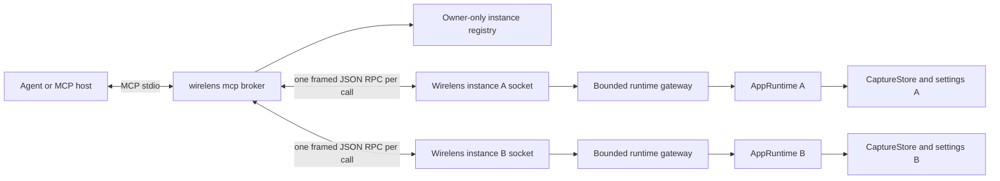

# Wirelens Multi-Instance MCP Control Plane Design

Date: 2026-08-24
Status: Approved revised design, pending written-spec review

## 1. Purpose

Wirelens will provide one Model Context Protocol connection through which local LLM agents can inspect and control several simultaneously running Wirelens proxy instances.

The first release serves two workflows:

1. Find retained captures in a selected proxy instance, inspect compact request/response metadata, and retrieve only relevant body regions or structured fields.
2. Inspect, validate, create, edit, activate, and toggle proxy mapping presets and rules in a selected instance.

A client-launched `wirelens mcp` process is the agent-facing MCP server over stdio. Each TUI/proxy process embeds a private, permission-restricted local control service. The broker discovers live instances and routes typed operations to them. This gives agents one stable configuration while keeping capture, settings, policy, resource limits, and audit ownership inside the target proxy process.

## 2. Process modes

### 2.1 Commands and configuration ownership

| Command shape | Mode | Configuration source | Mutation persistence |
|---|---|---|---|
| `wirelens` | `default_owned` | `~/.wirelens/config.yml` | Persistent |
| `wirelens --config <path>` | `read_only_file` | Supplied YAML, loaded once | Process-local only |
| `wirelens --host <ip> --port <port>` | `temporary` | Defaults plus CLI proxy bind override | Process-local only |
| `wirelens mcp` | `broker` | No proxy configuration | Not applicable |

Rules:

- Exactly one running process may own the default config. It holds an exclusive OS advisory lock on the stable `default-config.lock` sidecar for its lifetime; lock-file existence alone does not imply ownership, and the sidecar is not deleted on shutdown.
- A second `default_owned` launch fails clearly even if it could bind a different proxy port.
- Any number of read-only-file and temporary instances may coexist, subject to proxy endpoint and resource availability.
- `--config` cannot be combined with `--host` or `--port`.
- Temporary mode requires both `--host` and `--port`. Host is parsed as an IP address so the proxy endpoint has one canonical representation.
- `--mcp` and `--no-mcp` are mutually exclusive runtime overrides valid for each proxy mode. They are not valid with `wirelens mcp`.
- A process may load the default config through explicit `--config ~/.wirelens/config.yml`; that process is still read-only and does not compete for ownership.
- Read-only files are not hot-reloaded. The running instance owns an in-memory settings snapshot after startup.
- Temporary mode creates no configuration file.

### 2.2 MCP enablement

Persistent settings contain only an enable flag:

```yaml
mcp:
  enable: true
```

The default is false. The YAML section is omitted when semantically default while explicit default entries remain preserved by the existing generic serialization behavior.

Effective enablement order:

1. `--mcp` enables control for the run.
2. `--no-mcp` disables control for the run.
3. Otherwise use `mcp.enable` from the loaded/default settings.

An MCP-enabled proxy instance creates its private control socket and publishes a registry descriptor. A disabled instance proxies normally and is absent from broker discovery.

Effective MCP enablement is fixed at process startup. In-memory settings mutations do not start or stop the private control service, and the MCP tool surface does not edit `mcp.enable`.

## 3. Scope

### 3.1 Included

- Client-launched stdio MCP broker in the Wirelens binary.
- Concurrent discovery and control of multiple Wirelens proxy instances.
- Proxy endpoint as logical instance identity plus per-process run generation.
- Private owner-only Unix-domain instance control sockets.
- Atomic, owner-only instance registry with stale-entry validation and pruning.
- Versioned, length-prefixed JSON private RPC.
- Current stable MCP protocol plus earlier-version compatibility supplied by the official Rust MCP SDK.
- Compact broker, runtime, proxy, capture, persistence, and mapping status.
- Explicit live recording enable/disable control.
- Typed per-instance capture search over retained metadata and headers.
- In-flight capture visibility through immutable snapshots.
- Request/response detail retrieval without full body payloads.
- Bounded per-instance waiting for current or future matching captures.
- Raw and content-decoded body resources with bounded ranges.
- Bounded body text location that returns snippets and resource windows.
- JSON Pointer and form-field extraction.
- JSON field-name-to-pointer discovery.
- Wildcard JSON pointer-pattern structural probing.
- Mapping preset lifecycle, rule lifecycle, parent gates, dry-run validation, and URL decision explanation.
- Persistent validated settings commits in the default-owned instance.
- Ephemeral validated settings commits in read-only-file and temporary instances.
- Optimistic settings revisions and dirty-TUI-draft conflict rejection in every instance.
- Per-instance mutation audit records and aggregated read metrics.
- MCP prompts for HTTP-flow debugging and mapping configuration.

### 3.2 Excluded

- LAN or remote MCP access.
- Agent-facing Streamable HTTP.
- OAuth or bearer-token authentication.
- A resident system daemon or broker election among TUI processes.
- Cross-instance aggregate capture search or wait calls.
- Shared writable configuration between processes.
- Hot reload of supplied read-only files.
- Capture deletion or clearing through MCP.
- Request replay.
- Target-application automation; agents use other tools to trigger the app under test.
- Searching body content through `search_captures`.
- jq, JSONPath, recursive JSON wildcards, XML selectors, or arbitrary query languages.
- Full historical body versions for live captures.
- Enumerating every retained instance/capture/body through `resources/list`.
- Windows named-pipe instance control; the v1 multi-instance MCP control plane requires Unix-domain sockets and same-UID peer validation.

## 4. Decisions

- Agents configure one command: `wirelens mcp`.
- The broker lifetime follows the MCP host session. Broker exit never stops proxy instances.
- No TUI process is elected as a shared broker leader.
- Each MCP-enabled proxy process owns and enforces its capture/settings/body resource limits.
- The canonical proxy listen endpoint is the logical instance identity.
- A random 128-bit `run_id` distinguishes successive processes that reuse an endpoint.
- Snapshot reads may omit `run_id` and target the current owner of an endpoint.
- Mutations and long waits require the discovered `run_id`.
- Body resource URIs always include endpoint and `run_id`.
- Presets are identified by case-sensitive name. Rules are identified by preset name, table, and zero-based index together with an expected settings revision.
- MCP writes apply immediately after complete validation.
- Only `default_owned` may write a config file. Other instance modes apply settings changes in memory and lose them on exit.
- MCP writes are rejected while the target TUI settings popup has unsaved changes.
- Capture search results are lightweight and refer to heavier data by instance, capture ID, capture revision, and resource URI.
- Live captures are visible as immutable per-call snapshots.
- `get_capture` never returns full body payloads. Body pages use resources; targeted extraction may inline only a selected value within a 4 KiB threshold.
- Capture mutations are limited to explicit recording enable/disable.
- Deterministic tools are complemented by user-invoked MCP prompts; Wirelens does not implement agentic workflow tools.

## 5. Architecture



### 5.1 Dependency boundaries

The implementation should introduce these feature boundaries:

- `cli`: process-mode and option parsing into validated startup options.
- `instance`: canonical endpoint/run identity and config/persistence mode.
- `instance_registry`: descriptor schema, secure publication, discovery, validation, and stale cleanup.
- `control_rpc::protocol`: versioned envelopes, operation/result enums, limits, and length framing.
- `control_rpc::server`: private socket lifecycle, peer validation, one-request connections, and runtime gateway client.
- `control_rpc::client`: broker-side connect, deadline, request, response, and cancellation behavior.
- `mcp::broker`: stdio MCP service, instance resolution, tool/resource/prompt routing, and public schema conversion.
- `mcp::capture`: capture query schemas and compact result conversion.
- `mcp::body`: body resource metadata and public result conversion.
- `mcp::mapping`: MCP mapping schemas and conversion to settings-domain operations.
- `mcp::prompts`: prompt definitions that reference only real tools and resources.
- `mcp::audit`: client metadata and public operation audit context.

Mapping operations belong in a UI-independent settings-domain module shared by the TUI draft and control RPC commands. The broker and private RPC server must not call settings-popup editing methods.

The private RPC protocol carries typed domain operations, not arbitrary MCP JSON. Public MCP schemas and private RPC schemas may have different envelopes but share the same validated domain input/result types where their semantics are identical.

### 5.2 Runtime ownership

`AppRuntime` remains the serialization point for authoritative capture-store access and committed settings changes. Private control handlers do not receive shared mutable access to `App`, `CaptureStore`, or `SettingsManager`.

A bounded, non-dropping in-process command channel carries typed requests from the private socket service into the runtime. Runtime processing must:

- reject commands after shutdown begins;
- enforce a bounded number of pending and incremental commands;
- avoid awaiting while application state is borrowed;
- clone only compact values or `Arc`-backed immutable body/header data;
- never decode bodies, parse JSON, serialize large responses, or wait for future traffic in the runtime loop.

Body decoding, resource paging, text location, structured traversal, and timed waits happen in bounded instance-owned tasks after the runtime releases authoritative state. The broker performs no body decoding and owns no capture/settings state.

## 6. Instance identity and registry

### 6.1 Identity

A descriptor exposes:

```json
{
  "proxy_endpoint": "0.0.0.0:8989",
  "local_proxy_url": "http://127.0.0.1:8989",
  "run_id": "128-bit-random-value",
  "started_at": "2026-08-24T12:00:00Z"
}
```

- `proxy_endpoint` is the canonical `SocketAddr` used as logical identity.
- `local_proxy_url` is derived deterministically: an unspecified listen address maps to loopback in the same IP family, while a concrete address is preserved.
- `run_id` is generated from OS randomness for every process.
- Reusing an endpoint after restart creates a new generation.
- Process ID is diagnostic only; PID reuse never establishes identity or liveness.

### 6.2 Registry layout

Registry root:

```text
~/.wirelens/run/
├── default-config.lock
└── instances/
    ├── <bounded-endpoint-hash>.json
    └── <bounded-endpoint-and-run-hash>.sock
```

The run directory and instance directory are mode `0700`. Descriptors are regular files created with mode `0600` and published by same-directory atomic rename. The process umask/socket permissions make sockets owner-only.

Descriptor fields:

- descriptor schema version;
- private RPC version;
- Wirelens binary version;
- canonical proxy endpoint and local proxy URL;
- run ID, PID, and UTC start time;
- socket path;
- config mode: `default_owned`, `read_only_file`, or `temporary`;
- persistence: `persistent` or `ephemeral`;
- optional canonical source-config path.

The descriptor is published only after the proxy listener and private control socket are ready. On shutdown, the process removes the descriptor/socket only after re-reading and confirming its own run ID.

### 6.3 Secure discovery and stale cleanup

The broker:

1. scans at most 256 descriptors, each at most 64 KiB;
2. rejects symlinks, unexpected file types, wrong owners, invalid permissions, invalid schemas, and paths outside the run directory;
3. probes candidates with at most 16 concurrent connections;
4. verifies endpoint and run ID through the live private service;
5. returns only live instances;
6. removes a stale descriptor/socket only after re-reading and confirming the same stale run ID.

Crash leftovers are normal. A descriptor is never considered live from PID alone.

## 7. Private control RPC

### 7.1 Connection model

Use one Unix-socket connection per operation:

1. Broker connects.
2. Broker sends one request frame.
3. Instance sends one response frame.
4. Connection closes.

One-operation connections avoid multiplexing, connection-pool staleness, request demultiplexing, and a private cancellation message. While work is active, the instance monitors the connection read half for EOF; broker disconnect closes the socket and cancels associated incremental search, body, or wait work.

### 7.2 Framing

Each frame contains:

- four-byte unsigned big-endian payload length;
- one UTF-8 JSON payload;
- maximum request JSON payload of 1 MiB and response JSON payload of 8 MiB.

Request envelope:

```json
{
  "protocol_version": 1,
  "request_id": "opaque-trace-id",
  "run_id": "expected-run-id",
  "deadline_ms": 30000,
  "client": {
    "name": "declared-mcp-client",
    "version": "declared-version"
  },
  "operation": "search_captures",
  "arguments": {}
}
```

Response envelope contains the same protocol version and request ID and exactly one typed `result` or structured `error`.

Rules:

- Unknown versions, operations, enum variants, required fields, and trailing JSON data are rejected.
- Unknown object fields are rejected for protocol envelopes and operation arguments.
- The instance clamps deadlines to operation-specific maxima.
- Private binary body pages are base64 in JSON. The 64 KiB public page maximum remains well below the request/response caps after encoding. The larger response cap accommodates the existing bounded request-plus-response header previews and JSON escaping without weakening the smaller untrusted request cap.
- The broker verifies response protocol/request IDs.
- The instance verifies peer effective UID matches its own before accepting a request.
- Multiple brokers may connect concurrently; per-instance command, search, and body limits apply across all connections.
- The protocol version is independent from public MCP protocol versions. Version mismatch fails explicitly.

## 8. Agent-facing MCP broker

### 8.1 Transport and lifecycle

- Use the official Rust MCP SDK (`rmcp`) server support.
- Serve MCP over the broker process stdin/stdout.
- Stdout contains MCP frames only. Diagnostics go to stderr.
- Support the stable MCP protocol implemented by the selected SDK release and its documented earlier-version compatibility for mainstream CLI, desktop, and IDE hosts.
- Advertise tools, resource templates, and prompts.
- Return schema-validated structured content.
- Annotate read-only, idempotent, and destructive tools accurately.
- Honor MCP stdio cancellation by dropping/closing the corresponding private RPC connection.
- Broker exit never affects proxy instances.

Example host configuration:

```json
{
  "mcpServers": {
    "wirelens": {
      "command": "wirelens",
      "args": ["mcp"]
    }
  }
}
```

### 8.2 Broker-level tools

#### `list_instances`

Returns live discovered instances with:

- proxy endpoint and local proxy URL;
- run ID and start time;
- Wirelens and private RPC versions;
- config mode, persistence mode, and optional source path;
- recording state, retained capture count, active preset, and mapping gates.

Discovery diagnostics are summarized separately and never cause one malformed/stale descriptor to hide other live instances.

#### `get_broker_status`

Returns broker/MCP/RPC versions, registry path, live/stale/rejected descriptor counts, connection failures, request saturation/cancellation metrics, bytes relayed, and public limits. It contains no capture or mapping data.

### 8.3 Instance selector

Every instance-scoped tool accepts:

```json
{
  "instance": {
    "proxy_endpoint": "0.0.0.0:8989",
    "run_id": "optional-for-snapshot-reads"
  }
}
```

Resolution rules:

- If omitted and exactly one live instance exists, select it.
- If omitted and no live instances exist, return `no_instances`.
- If omitted and several live instances exist, return `instance_required` with a bounded compact list.
- Snapshot reads may omit run ID and target the current owner of the endpoint. The result always returns the resolved run ID.
- If a snapshot read omitted run ID and the endpoint generation changes during resolution, the broker may re-resolve once to the current process; supplied run IDs are never retargeted.
- Mutations and `wait_for_capture` require run ID.
- Targeted body tools require run ID because their results/resources are capture-generation-specific.
- Resource URIs always contain run ID.
- Endpoint reuse with a different run ID returns `instance_generation_conflict` for stale writes, waits, targeted body operations, and resources.

The broker does not implement aggregate cross-instance search/wait. Agents issue separate calls through the same MCP connection.

## 9. State and consistency model

### 9.1 Capture identities and revisions

- `capture_id`: decimal monotonic `CaptureSequence` assigned at request admission within one run.
- `capture_revision`: per-record revision incremented when response metadata, published body bytes, terminal state, or capture timing changes.
- `store_revision`: increments when a capture is added, evicted, removed, or the store is cleared.
- `capture_epoch`: per-run monotonic signal incremented for store changes and externally visible capture revision changes.
- `settings_revision`: per-run optimistic concurrency token initialized after settings load and incremented after every successful TUI or RPC settings commit.

Capture IDs are scoped by endpoint and run ID. Evicted IDs are not reused during the run. Settings revisions are not persisted.

### 9.2 Capture snapshots

Add one capture-record snapshot operation that acquires the record lock once and returns internally consistent:

- request and optional response metadata;
- request and response body statuses;
- `Arc<Bytes>` previews when required by the internal caller;
- timing values;
- metadata truncation;
- capture revision.

Targeted body operations/resources require the revision obtained from capture detail. If a live record changed, return `capture_revision_conflict` with the current revision. Wirelens does not retain historical live-body revisions.

### 9.3 Capture timing

Each capture records UTC request start plus monotonic time-to-response and total exchange duration. Total duration becomes known when both body streams are terminal. In-flight snapshots omit unavailable durations. Elapsed values never derive from wall-clock differences.

### 9.4 Settings transactions and persistence modes

Every settings mutation requires `expected_settings_revision` and rejects a dirty TUI draft.

Common steps:

1. Compare expected and current run-local revisions.
2. Clone current `AppSettings`.
3. Apply exactly one shared typed domain mutation.
4. Validate and compile the complete candidate policy.

`default_owned` then:

5. Serializes through existing semantic-default/key-order preservation.
6. Writes and flushes a same-directory temporary file.
7. Atomically renames it over the default config.
8. Swaps the already-compiled live policy.
9. Replaces runtime/App settings, increments revision, and refreshes a clean TUI draft.
10. Returns `persistence: persistent`.

`read_only_file` and `temporary` instead:

5. Swap the already-compiled live policy.
6. Replace only in-memory runtime/App settings.
7. Increment revision and refresh a clean TUI draft.
8. Return `persistence: ephemeral`.

Validation, compilation, or persistent I/O failure leaves prior persisted settings, live policy, App settings, TUI draft, and revision unchanged. The settings UI labels its final action `Save` for persistent mode and `Apply` for ephemeral modes, and displays the active config mode.

## 10. Tool surface

All collection limits are bounded. Every instance-scoped result repeats the resolved proxy endpoint and run ID. Settings results also repeat config mode and persistence.

### 10.1 Status and recording

#### `get_status`

Returns compact selected-instance proxy/run/config identity, recording state, active preset and gates, capture revisions/count/retention, capture/decode/drop/truncation metrics, per-instance RPC saturation, body/search limits, and the local unauthenticated-access warning.

#### `set_recording_enabled`

Requires endpoint/run ID and explicit `enabled: bool`. Returns previous/current state. It is idempotent and changes only live recording, not launch settings.

### 10.2 Capture discovery

#### `search_captures`

AND-combined optional filters:

- method;
- original/effective URL substring or glob;
- exact status or inclusive status range;
- retained header name and optional value substring;
- mapping path: `unmapped`, `remote_only`, `local_only`, or `remote_then_local`;
- lifecycle: `live`, `complete`, `failed`, or `cancelled`;
- UTC start-time bounds;
- capture sequence bounds;
- Unicode text across method, URLs, status text, and retained headers.

Mapping path derives from original/effective URL difference and presence of a local path. Lifecycle precedence is failed, then cancelled, then complete, then live.

Results are newest-first with sequence cursor pagination. Compact rows contain instance/run identity, capture ID/revision, method, URLs, mapping path, status/lifecycle, timing, and per-side observed/retained/truncation state. They contain no header values or body payloads. Default page size is 20; maximum is 100.

#### `get_capture`

Accepts capture ID and an optional expected capture revision. Returns one internally consistent selected capture detail: request/response metadata and retained headers, mapping/timing/lifecycle/truncation, body descriptors, current revision, and concrete first-page body resource links. It does not return full body payloads.

#### `wait_for_capture`

Requires endpoint/run ID. Accepts capture filters, milestone (`request_seen`, `response_started`, or `exchange_terminal`), and timeout. `exchange_terminal` includes complete, failed, and cancelled outcomes. It subscribes to capture epoch before initial search. Timeout returns `{ "matched": false }`, not an error.

### 10.3 Targeted body tools

Every body tool requires endpoint/run ID, capture ID/revision, and side. Decoding/parsing occurs in the target instance under hard budgets.

#### `search_capture_body`

Returns bounded Unicode text snippets, decoded byte ranges, larger-window resource links, total/omitted matches, decoded bytes inspected, and source truncation. Binary/undecodable content returns typed status with raw resource fallback.

#### `extract_capture_body`

Supports exact RFC 6901 JSON Pointer and URL-form field key. A scalar or compact JSON/form result up to 4 KiB is inline. Larger JSON selections become compact-JSON resources; repeated form values become JSON string-array resources. Misses return longest valid prefix and bounded next keys/types without parent values.

#### `find_json_pointers`

Finds object keys by `exact` or `unicode_casefold_exact` name without values. Returns exact escaped RFC 6901 pointers plus value type, object child count, array length, or scalar encoded size. Reports total/omitted matches, inspected bytes, truncation, and revision.

#### `probe_json_pointer_pattern`

Pattern rules:

- `~0` means `~`;
- `~1` means `/`;
- an unescaped whole `*` segment matches one object key or array index;
- `~2` means a literal `*` key;
- no recursive wildcard;
- empty pattern addresses root; `/` addresses an empty object key;
- a pattern without wildcard performs an exact structural probe.

Returns match count, terminal type counts, up to 20 exact pointer examples, bounded object child-key summaries, array length range, truncation, and revision. Misses return longest matched prefix and bounded next segments/types. Field discovery and probing use streaming traversal so working state is proportional to nesting depth and bounded results rather than a full JSON object graph.

### 10.4 Mapping inspection and validation

- `get_mapping_settings`: selected instance proxy configuration plus settings revision/config/persistence mode.
- `validate_mapping_settings`: compile/validate a complete proposed proxy config without mutation.
- `explain_mapping`: explain current or proposed URL decision, matched preset/table/rule, effective URL/local path, gates, and diagnostics without traffic or mapped-file reads.

### 10.5 Mapping mutations

- `create_preset`
- `rename_preset`
- `delete_preset`
- `set_active_preset`
- `set_mapping_gate`
- `create_mapping_rule`
- `update_mapping_rule`
- `delete_mapping_rule`
- `move_mapping_rule`
- `set_mapping_rule_enabled`

Every mutation requires endpoint/run ID and expected settings revision and returns new revision plus persistence mode.

Conventions:

- preset names are trimmed, non-empty, and case-sensitive unique;
- all rule indices are zero-based;
- create preset accepts an optional complete preset, defaults to empty enabled sections, and does not activate implicitly;
- renaming active updates active preset;
- deleting active clears active preset;
- set active accepts name or null;
- omitted insertion index appends;
- move destination is final post-move index;
- update rule changes source/target; enable uses the explicit setter.

Delete tools are destructive. Explicit setters are idempotent.

## 11. MCP resources

The broker advertises templates only. `resources/list` returns no direct resources. Resource subscriptions/list-change notifications are not advertised.

`resources/templates/list` returns these three RFC 6570 templates, using reserved expansion for the canonical endpoint authority:

```text
wirelens://{+proxy_endpoint}/runs/{run_id}/captures/{capture_id}/revisions/{capture_revision}/bodies/{side}/content/{representation}{?offset,length}
wirelens://{+proxy_endpoint}/runs/{run_id}/captures/{capture_id}/revisions/{capture_revision}/bodies/{side}/extract/json-pointer{?pointer,offset,length}
wirelens://{+proxy_endpoint}/runs/{run_id}/captures/{capture_id}/revisions/{capture_revision}/bodies/{side}/extract/form-field{?key,offset,length}
```

Concrete resource URI:

```text
wirelens://0.0.0.0:8989/runs/{run_id}/captures/{capture_id}/revisions/{capture_revision}/bodies/{side}/content/{representation}{?offset,length}
```

Structured selections:

```text
wirelens://0.0.0.0:8989/runs/{run_id}/captures/{capture_id}/revisions/{capture_revision}/bodies/{side}/extract/json-pointer{?pointer,offset,length}
wirelens://0.0.0.0:8989/runs/{run_id}/captures/{capture_id}/revisions/{capture_revision}/bodies/{side}/extract/form-field{?key,offset,length}
```

- Authority is the canonical proxy endpoint; IPv6 uses standard bracket syntax.
- Raw content is MCP blob content; range applies before base64 transport encoding.
- Decoded valid UTF-8 is text with retained media type; decoded binary is blob.
- Decoded range applies after content decoding.
- JSON selection resources contain deterministic compact JSON.
- Form resources contain JSON string arrays.
- Default page is 8 KiB; maximum is 64 KiB.
- `_meta.wirelens` contains requested/actual range, selected representation size, next URI, endpoint/run/capture revisions, stream state, observed/retained bytes, and truncation.
- Text ranges must align to UTF-8 boundaries. Invalid manual ranges return nearest valid offsets. Tool-generated URIs are aligned.
- Live resources have no cache lifetime. Terminal resources may be private-cached, but instance exit, endpoint restart, or capture eviction returns a typed error.

The broker parses endpoint/run from the URI, validates the live descriptor, performs one typed private RPC, and wraps the returned payload as MCP resource content.

## 12. Prompts

### 12.1 `debug_http_flow`

Starts with `list_instances`, requires explicit endpoint selection when several are live, checks recording, waits/searches narrowly, inspects compact detail, locates text/JSON structure before reading resource windows, and states retention/truncation/live/decode limitations. Target-app triggering remains outside Wirelens.

### 12.2 `configure_mapping`

Starts with `list_instances`, fixes endpoint/run identity, reads settings revision/persistence, validates and explains a candidate, applies only user-requested mutations, refreshes revision after every write, reports persistent versus ephemeral result, and verifies live behavior through new traffic when applicable.

Prompts never apply changes to all instances implicitly and never name nonexistent tools/resources.

## 13. Limits and scheduling

| Limit | Value |
|---|---:|
| Registry descriptors scanned | 256 |
| Descriptor size | 64 KiB |
| Concurrent liveness probes | 16 |
| Concurrent broker calls | 32 |
| Private RPC request / response JSON | 1 MiB / 8 MiB |
| Concurrent private RPC calls per instance | 32 |
| In-flight serialized private responses per instance | 32 MiB |
| Runtime command channel per instance | 64 |
| Concurrent incremental capture searches per instance | 4 |
| Ordinary tool/resource deadline | 30 s |
| Capture search default / maximum | 20 / 100 rows |
| Body resource default / maximum | 8 KiB / 64 KiB |
| Body text matches default / maximum | 10 / 50 |
| Match context default / maximum per side | 160 B / 1 KiB |
| Inline selected structured value | 4 KiB |
| JSON pointer/shape examples | 20 |
| Wait default / maximum | 30 s / 5 min |
| Body decoded/structured input | 16 MiB |
| Active body jobs per instance | 2 |
| Queued body input per instance | 8 jobs and 32 MiB |

These are fixed v1 constants reported by broker/instance status and are not externally configurable.

Capture searches execute incrementally under the target runtime event budget, scan newest to oldest, stop when a page fills, yield between bounded chunks, and check socket cancellation/deadline. Concurrent scans are capped and fair. No permanent folded-header index is introduced in v1.

`wait_for_capture` waits in the instance control service, subscribes before initial query, rechecks only changed sequences/revisions, and never parks AppRuntime.

## 14. Security

- Agent-facing transport is client-launched stdio; there is no HTTP listener, Host/CORS/Origin surface, or MCP port.
- Broker stdout contains MCP only; diagnostics use stderr.
- Run/registry directories are owner-only; descriptors and sockets are owner-only.
- Broker rejects symlinks, wrong owners/permissions/types, escaping paths, invalid schemas, oversized input, and unsupported versions.
- Instance verifies peer effective UID, RPC version, endpoint, and run ID.
- Default config lock is owner-scoped and held for process lifetime.
- Source config paths are returned only to same-user local clients.
- Captured headers/bodies and mapping values are never logged by the broker/private transport.
- Raw retained Authorization, Cookie, Set-Cookie, request-body, and response-body data is returned when explicitly requested. There is no default redaction.
- On unsupported platforms, ordinary proxy/TUI operation remains available, while `--mcp` and `wirelens mcp` fail explicitly with `unsupported_platform`.

Warning shown in instance logs and `get_status`:

> MCP access is unauthenticated within the current OS user account. Any process running as this user can launch the broker, read raw retained captures from MCP-enabled Wirelens instances, and change their live proxy mappings.

## 15. Errors

Public expected failures use structured MCP tool errors with stable code, concise message, retryable flag, and typed details. Resource failures use JSON-RPC errors with the same structured data. Internal filesystem/socket paths and backtraces are not exposed.

Initial codes:

- `invalid_argument`
- `no_instances`
- `instance_required`
- `instance_not_found`
- `instance_generation_conflict`
- `instance_unavailable`
- `rpc_version_mismatch`
- `rpc_frame_too_large`
- `default_config_already_owned`
- `unsupported_platform`
- `capture_not_retained`
- `capture_revision_conflict`
- `settings_revision_conflict`
- `tui_draft_conflict`
- `mapping_validation_failed`
- `unsupported_body_encoding`
- `body_not_textual`
- `structured_body_too_large`
- `invalid_json`
- `resource_limit`
- `service_unavailable`
- `deadline_exceeded`
- `internal_error`

No-match search/probe and wait timeout are successful empty results. Broker cancellation closes the private connection. Instance exit during a wait returns cancellation with endpoint/run identity. Mapping diagnostics preserve typed locations; JSON misses preserve bounded structural guidance.

## 16. Lifecycle and failure handling

### 16.1 Proxy instance startup

1. Parse and validate process mode/options.
2. Acquire default config lock when applicable.
3. Load settings and calculate effective MCP enablement.
4. Compile request policy.
5. Bind/start the proxy and observe readiness.
6. If MCP-enabled, securely bind the private socket and start the control service.
7. Atomically publish the descriptor only after proxy/control readiness.
8. Enter TUI/event processing.

Enabled private-control bind/publication failure aborts startup before registry visibility. Unexpected private-control service exit is fatal for that instance and uses controlled shutdown/terminal restoration.

### 16.2 Shutdown

- Cancel outstanding private operations.
- Remove descriptor only when run ID still matches.
- Remove owned socket.
- Release default config lock.
- Restore terminal through existing runtime cleanup.

Broker processes connect/exit independently. Broker failure or normal exit never stops proxy instances.

## 17. Audit and metrics

### 17.1 Instance audit

Each target instance audits MCP mutations with endpoint, run ID, config/persistence mode, declared client name/version, operation, target identity without captured values, prior/resulting settings revision, result/error code, and duration.

Read operations are aggregated every 60 seconds by endpoint/run/client/tool with counts, failures, cancellation, latency buckets, and bytes returned. Queries/body contents are not logged.

Client metadata is declared and untrusted because there is no authentication.

### 17.2 Broker diagnostics

The broker emits only discovery/transport/version/saturation diagnostics to stderr. It does not persist a second body/query audit log. `get_broker_status` exposes bounded counters.

## 18. Verification

### 18.1 Unit tests

- CLI mode exclusivity, required host/port pair, MCP overrides, and broker subcommand isolation.
- MCP settings defaults, serialization omission, and explicit-default preservation.
- Default lock acquisition/release and read-only access to the same file.
- Persistent versus ephemeral settings commit behavior and TUI Save/Apply presentation state.
- Registry path hashing, permissions, atomic publication, descriptor validation, symlink/owner/type rejection, and race-safe stale pruning.
- Endpoint/run identity, endpoint reuse, and PID reuse.
- Private framing under partial/combined reads, invalid lengths/UTF-8/JSON, unknown fields/operations, version mismatch, response ID validation, deadline, disconnect cancellation, and peer UID rejection.
- Broker singleton auto-selection and multi-instance explicit-selection errors.
- Capture query filters, pagination, compact shape, cancellation, timing, revision, and mapping/lifecycle classification.
- Snapshot consistency and stale/evicted capture behavior.
- Raw/decoded resources, UTF-8 boundaries, compressed/binary/malformed/truncated content, next-page metadata, and run/revision conflict.
- Body text search, JSON Pointer extraction, form repeats, field-name exact/casefold discovery, wildcard/literal-star probes, miss guidance, and structural limits.
- Every preset/rule/gate mutation through shared domain operations.
- Mapping validation/explanation agreement with runtime compilation.
- Stale settings/run revisions, dirty draft, clean draft refresh, persistent rollback, and ephemeral apply.
- Prompt references and audit-content exclusion.

### 18.2 Runtime and integration tests

- Exactly one default-owned instance; concurrent read-only/temporary instances on distinct endpoints.
- Same endpoint bind conflict.
- MCP-disabled instance absent from registry.
- Enabled control startup failure and fatal unexpected exit.
- Proxy/control readiness before registry publication.
- One broker discovers and routes to three modes.
- Multiple brokers connect concurrently while per-instance limits remain global.
- Concurrent calls to distinct instances never cross captures/settings/audits.
- Stale run writes, waits, targeted body operations, and resources fail after endpoint restart.
- Broker exit leaves all proxies alive.
- Incremental absent searches preserve runtime event-loop progress.
- Atomic persistent commit/live swap and no source/temp file writes for ephemeral modes.
- Clean stdio MCP conformance with no stdout diagnostic contamination and supported protocol-version clients.

### 18.3 End-to-end smoke scenario

1. Start one default-owned, one read-only-file, and one temporary instance on distinct proxy endpoints with MCP enabled.
2. Verify a second default-owned launch fails.
3. Start one `wirelens mcp` broker and list all instances.
4. Omit selection and verify `instance_required`; then target each endpoint/run.
5. Proxy separate synthetic exchanges, including compressed JSON, through two instances.
6. Search both through separate concurrent calls and verify no cross-instance data.
7. Retrieve detail, find a field pointer, probe wildcard structure, extract one value, and read one run-scoped resource window.
8. Persist a mapping change in default-owned.
9. Apply ephemeral mapping changes in read-only and temporary instances and verify source/no config files remain unchanged.
10. Explain and verify each live mapping through new traffic.
11. Restart one endpoint and verify old-run writes, waits, and resources fail.
12. Exit broker and verify proxies continue.
13. Confirm audit records remain in target instances and contain no traffic contents.

### 18.4 Performance coverage

Criterion cases:

- 256-entry registry scan and liveness filtering;
- broker/private-RPC round trip;
- concurrent routing to several instances;
- 10,000-capture absent/sparse/full-page metadata/header search;
- body text location at retained limits;
- JSON field discovery and wildcard probe at structured limit;
- decoded resource paging and base64 private relay;
- rapid capture-epoch wakeups and cancellation;
- concurrent body-job/private-RPC saturation.

Runtime tests prove incremental searches yield within the event budget. Memory tests prove queued body bytes and concurrent decoded/structured work stay within per-instance budgets.

## 19. Acceptance criteria

The feature is complete when:

- one `wirelens mcp` agent configuration discovers and controls several running proxy instances;
- default-owned, read-only-file, and temporary modes behave exactly as specified;
- only one process owns/persists the default config;
- read-only and temporary mapping changes are live but never written;
- endpoint/run identity prevents stale actions from reaching a restarted process;
- private registry/socket/RPC boundaries are owner-only, versioned, bounded, and cancellation-aware;
- broker exit cannot stop proxy instances;
- agents can obtain status, set recording, search/detail/wait captures, discover JSON structure, extract selected values, and read bounded resources in a selected instance;
- body results truthfully report retained, observed, truncated, decoded, live, and stale states;
- agents can inspect, validate, explain, create, edit, reorder, delete, activate, and toggle mapping presets/rules with optimistic concurrency;
- TUI and control RPC use one mapping mutation/validation implementation;
- dirty TUI drafts cannot be overwritten;
- persistent writes are atomic/immediately live and ephemeral writes are immediately live/process-local;
- bounded broker/RPC/body/search work cannot stall proxy forwarding or AppRuntime;
- audit data is useful, per-instance, and free of captured traffic contents;
- focused, full, strict lint, stdio/RPC, smoke, and benchmark checks pass;
- required post-implementation design/maintainability and performance subagent reviews are completed and adopted where applicable.

## 20. References

- [MCP server concepts](https://modelcontextprotocol.io/docs/2026-07-28/learn/server-concepts)
- [MCP transports](https://modelcontextprotocol.io/specification/2026-07-28/basic/transports)
- [MCP stdio transport](https://modelcontextprotocol.io/specification/2026-07-28/basic/transports/stdio)
- [MCP resources](https://modelcontextprotocol.io/specification/2026-07-28/server/resources)
- [Official Rust MCP SDK](https://github.com/modelcontextprotocol/rust-sdk)
